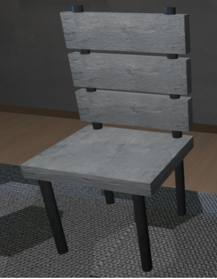
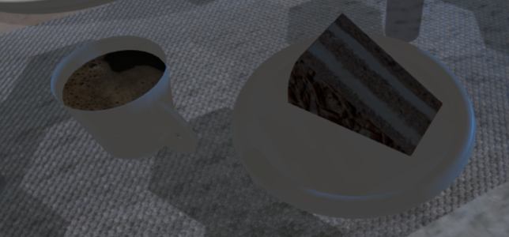

# SGI 2024/2025 - TP1

## Group T04G07
| Name                                      | Number    | E-Mail             |
| ----------------------------------------- | --------- | ------------------ |
| João Brandão Alves                        | 202108670 | up202108670@up.pt  |
| José Francisco Reis Pedreiras Neves Veiga | 202108753 | up202108753@up.pt  |

----
## Project Information

- **Disclaimers**
  - The wooden looking table is place on the corner of the scene.

- **Main Highlights**
  - All objects that were requested in the requisites were created. Some extras like a sofa, a rug and lamps highlighting some objects were created too.
  - Utilization of custom geometries, NURBS surfaces, and parametric designs to create realistic and dynamic objects.
  - Implementation of materials and textures to enhance visual some realism across multiple objects in the scene.
  - All types (or at least all that we know) were used in order to create highlights and create some good shadows. PointLight, SpotLight, RectAreaLight and DirectionalLight were used.

- **Scene**
  - The scene contains a wide array of objects to build a detailed environment:
    - **Furniture**: Includes objects like `MyChair`, `MyTable`, `MySideTable`, `MySofa`, and `MyTableLamp`, creating a cohesive interior space.
    - **Decorative Items**: Objects such as `MyCandle`, `MyPainting`, `MyRug`, and `MyPlate` add visual interest and detail to the scene.
    - **Unique Models**:
      - **MyFlower**: A custom flower model with a curved stem and realistically positioned petals and leaves.
      - **MyNewspaper**: A NURBS-based newspaper model featuring two parabolic-like pages side-by-side, mimicking the look of an open newspaper.
      - **MyJar**: A sophisticated jar with varying textures and a dirt layer, designed to showcase realistic shading and reflections.
      - **MyBeetle**: A specialized model representing a beetle.
      - **MySpring**: A spring model demonstrating the use of curved geometries in mechanical structures.
    - **Structural Elements**: `MyWall`, `MyFloor` provide foundational elements to set up the environment’s spatial boundaries. These also contain the creation of the door, window and baseboards too.
  
  
  
Image 1: Scene

  
  
Image 2: Scene

  
  
Image 3: Scene

    
  
Image 4: Table

  - [Relative Link to Scene (Screenshots)](./screenshots)

----
## Issues/Problems

- **Petals Adjustments:** Achieving precise petal orientations to resemble a sunflower/sun shape required multiple manual adjustments; some limitations with geometry placement remain, particularly in ensuring uniform outward-facing petal orientation.
- **Newspaper Curvature Fine-tuning:** The control points for the NURBS surface required careful tuning to match the desired parabolic look. Further fine-tuning could make adjustments more intuitive.
- **Performance Considerations:** Using a lot of physical materials in order to make use of RectArea light impacted performance, specially the glass table; reducing the amount of physical objects (walls, floor, glass table and rug) improves performance but sacrifices some visual.
- **Lights:** Most of the lights were actually hard to place correctly due to the fact that most of the times the light helpers weren't really usefull as they shown wrong positions and directions of the light.
