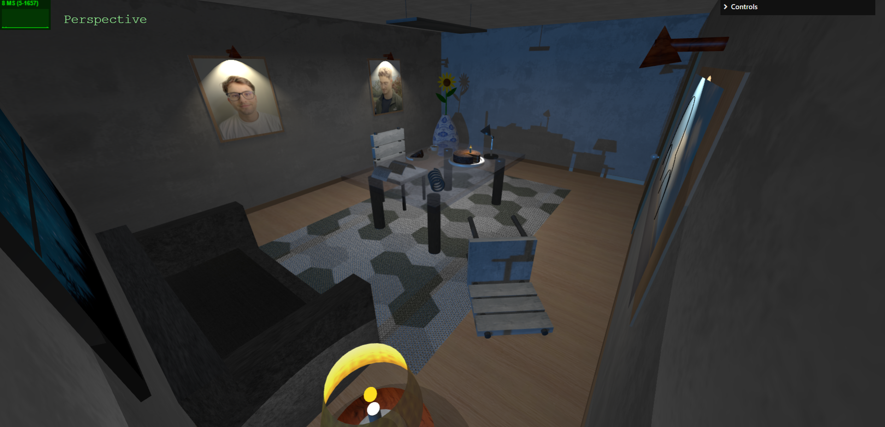

# SGI 2024/2025 - TP1

## Group T04G07
| Name                                      | Number    | E-Mail             |
| ----------------------------------------- | --------- | ------------------ |
| João Brandão Alves                        | 202108670 | up202108670@up.pt  |
| José Francisco Reis Pedreiras Neves Veiga | 202108753 | up202108753@up.pt  |

----
## Project Information

- **Disclaimers**
  - The wooden looking table is place on the corner of the scene as we wanted to try to create a glass looking table at the middle of the scene.

- **Main Highlights**
  - All objects that were requested in the requisites were created. Some extras like a sofa, a rug, a cup, chairs and lamps highlighting some objects were created too.
  - Utilization of custom geometries, NURBS surfaces, and parametric designs to create more realistic objects, like the newspaper, the jar and the flower. NURBS surfaces were used in newspaper and in the jar.
  - Implementation of materials and textures to enhance visual some realism across multiple objects in the scene (physical materials).
  - It's possible to make objects disappear from the scene in the controls and there are all the cameras required in the controls too.
  - All types of lights (or at least all that we know) were used in order to create highlights and create some good shadows. PointLight, SpotLight, RectAreaLight and DirectionalLight were used. The RectAreaLight is used in the lamp right above the glass table. The DirectionalLight was placed like the light is comming from the window in order to create a great shadow into a wall like shown in the image below.

  IMAGE HERE

- **Scene**
  - The scene contains a wide array of objects to build a detailed environment:
    - **Furniture**: Includes objects like `MyChair`, `MyTable`, `MySideTable`, `MySofa`, and `MyTableLamp`, creating a cohesive interior space.
    - **Decorative Items**: Objects such as `MyCandle`, `MyPainting`, `MyRug`, `MyCake` and `MyPlate` add visual interest and detail to the scene.
    - **Unique Models**:
      - **MyFlower**: A custom flower model with a curved stem and realistically positioned petals and leaves.
      - **MyNewspaper**: A NURBS-based newspaper model featuring two parabolic-like pages side-by-side, mimicking the look of an open newspaper.
      - **MyJar**: A NURBS-based jar with varying textures and a dirt layer, designed to showcase a more realistic shading.
      - **MyBeetle**: A specialized model representing a beetle.
      - **MySpring**: A spring model demonstrating the use of curved geometries in mechanical structures.
    - **Structural Elements**: `MyWall`, `MyFloor` provide foundational elements to set up the environment’s spatial boundaries. These also contain the creation of the door, window and baseboards too.

### **Now some screenshots of the objects:** 
  
  

    
    
Image 1: Beetle with painting background

  

  

    
    
Image 2: Cake, Candle, Plate

  

  

    
    
Image 3: Chair

  

  

    
    
Image 4: Cup, Plate and Slice

  

  

    
    
Image 5: Door

  

  

    
    
Image 6: Jar and Flower

  

  

    
    
Image 7: Table Lamp

  

  

    
    
Image 8: Newspaper

  

  

    
    
Image 9: Spring

  

  

    
    
Image 10: Paintings

  

  

    
    
Image 11: Window and Sofa

  

  

    
    
Image 12: Wood Table and Lamp

  

  

    
    
Image 13: Complete Scene

  

  

    
    
Image 14: Complete Scene

  

  

    
    
Image 15: Complete Scene

  

  - [Relative Link to Scene (Screenshots)](./screenshots)

----
## Issues/Problems

- **Petals Adjustments:** Achieving precise petal orientations to resemble a sunflower/sun shape required multiple manual adjustments.

- **Jar Curvature Fine-tuning:** The control points for the NURBS surface required careful tuning to match the desired look. The final look doesn't really resamble the first idea of look.

- **Lights:** Most of the lights were actually hard to place correctly due to the fact that most of the times the light helpers weren't really usefull as they shown wrong positions and directions of the light.

- **Performance Considerations:** Using physical materials table, walls, glass table and floor in order to make use of RectArea light impacted performance, specially the glass table; reducing the amount of physical objects (walls, floor, glass table and rug) improves performance but sacrifices some visual.
