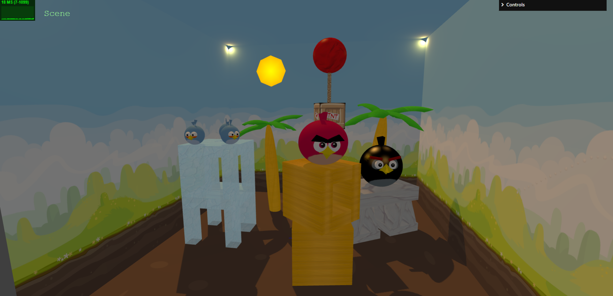
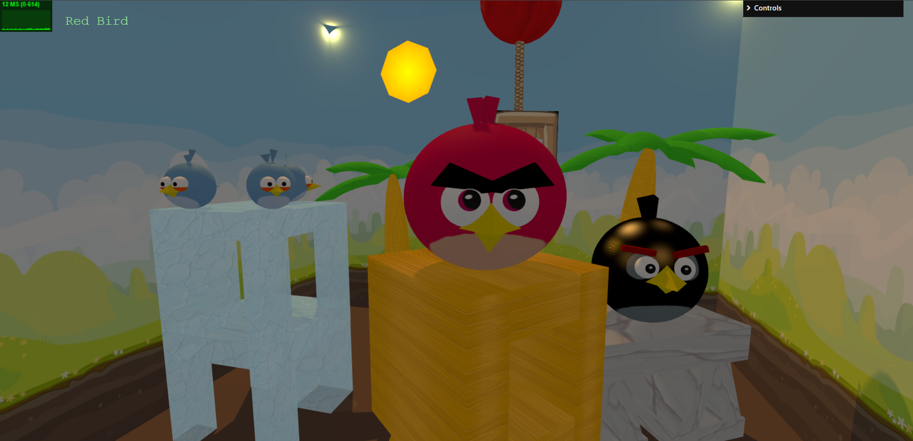
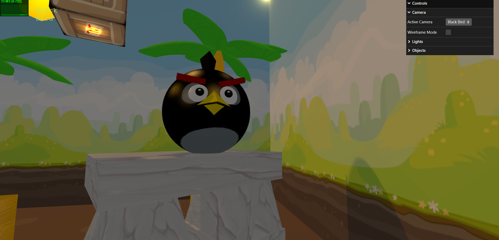
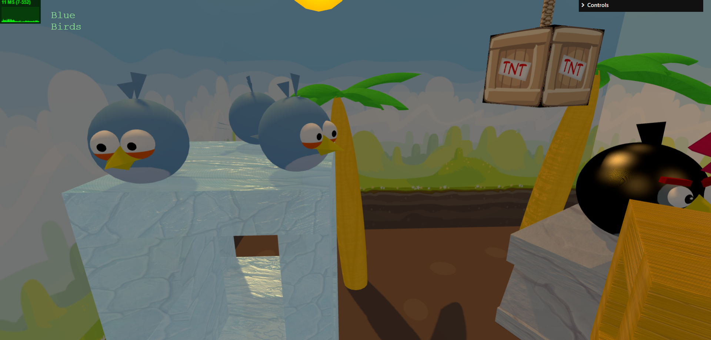
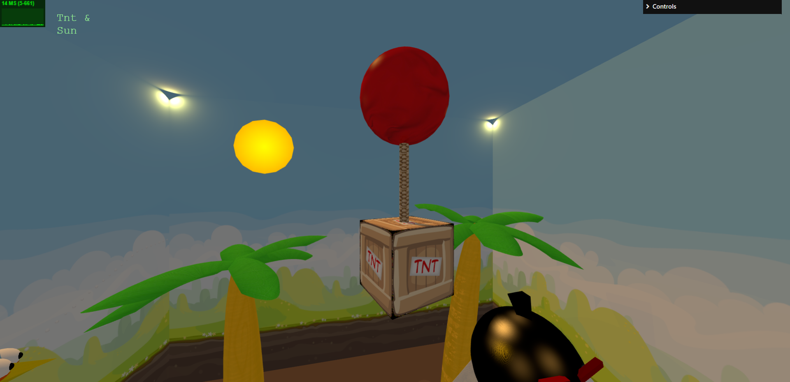

# SGI 2024/2025 - TP2

## Group T04G07
| Name                                      | Number    | E-Mail             |
| ----------------------------------------- | --------- | ------------------ |
| João Brandão Alves                        | 202108670 | up202108670@up.pt  |
| José Francisco Reis Pedreiras Neves Veiga | 202108753 | up202108753@up.pt  |

----

## Project Information

This project is a 3D graphics application built using Three.js and a custom scene description format called **YASF** (Yet Another Scene Format). The application dynamically generates 3D scenes from a JSON file that follows the YASF specification, enabling a robust and hierarchical approach to building 3D environments.

### Features

1. **Scene Graph Implementation**:
   - The application parses a hierarchical JSON structure to create 3D scenes.
   - Supports nodes with inheritance for transformations, materials, and shadows.

2. **Lighting**:
   - Directional, Point, and Spotlights are supported.
   - Lights can cast shadows based on their configuration in the JSON.

3. **Primitives**:
   - Supports basic primitives like rectangles, triangles, spheres, cylinders, polygons, and NURBS surfaces.
   - NURBS surfaces are dynamically generated using control points defined in the JSON.

4. **Skybox**:
   - Includes support for textured skyboxes with user-defined dimensions and positions.

5. **Level of Detail (LOD)**:
   - Nodes can have LOD configurations for efficient rendering based on the camera's distance.

6. **Advanced Textures**:
   - Includes support for mipmaps, bump maps, and video textures.
   - Materials can be customized with emissive, specular, and diffuse properties.

7. **Interactive Controls**:
   - Toggle between wireframe and solid rendering modes.
   - Change light states (on/off) and shadow settings dynamically.
   - Make objects appear/disappear.

---

## Screenshots

Below are some screenshots of the implemented features:

### All Scene

### Red Bird

### Black Bird

### Blue Birds

### Tnt & Sun

---

## Issues/Problems

During the development of the project, the following issues were encountered:

1. **NURBS Parsing**:
   - Problem: Setting `degree_u` or `degree_v` to `1` caused runtime errors.
   - Solution: Adjusted the NURBS builder to handle edge cases for low-degree surfaces and ensure proper knot vector calculations.

2. **Some Performance Optimization**:
   - Problem: Rendering large scenes with multiple lights and high-polygon objects caused performance drops.
   - Solution: Implemented LOD for distant objects and used mipmap textures for better performance.

---

